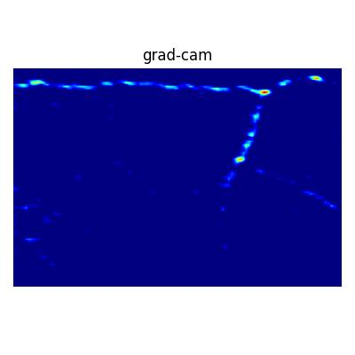

# easy_gradcam

A lightweight tool to generate Grad-CAM visualizations for image classification models.
It supports popular backbones such as **ResNet**, **Vision Transformers (ViT)**, and **Hugging Face Transformers**.

This package is built on top of PyTorch for deep learning model implementation, 
and provides visualization utilities powered by Matplotlib and Seaborn. 
It is designed to help users easily train, evaluate, and visualize results 
with clear and customizable plots.

---

## Installation
[PyPI Link](https://pypi.org/project/easy-gradcam/)
```bash
pip install easy_gradcam
```

## Build from Source

If you want to install the latest development version (or install after modifying the code), you can build and install directly from GitHub:
```bash
git clone https://github.com/breeze0305/easy_gradcam
cd easy_gradcam
```

Install the build tools:
```bash
pip install build twine setuptools wheel
```

Then run the following commands to build and verify:
```bash
python -m build
twine check dist/*
```

Finally, install the built package:
```bash
pip install dist/easy_gradcam-x.x.x-py3-none-any.whl
```

## Quick Start

### 1. Import dependencies
```python
# === data preprocess === 
import cv2
from PIL import Image
from pathlib import Path
import torchvision.transforms as transforms

# === model(maybe choose one?) ===
import torchvision.models as models
import timm
from transformers import AutoModelForImageClassification

# === this visualization tool ===
from easy_gradcam.classification import EasyGradCAM
from easy_gradcam.visualization import save_heatmap, save_mix_heatmap
```

### 2. Load a model
You can use different backbones:
```python
# Example 1: ResNet-50 (from torchvision)
model = models.resnet50(pretrained=True)   # targets: "layer4"

# Example 2: ViT (from timm)
model = timm.create_model("vit_base_patch16_224_miil", pretrained=True)   # targets: "blocks.10"

# Example 3: DINOv2 (from Hugging Face)
model = AutoModelForImageClassification.from_pretrained(
    "facebook/dinov2-small-imagenet1k-1-layer"
) # targets: "dinov2.encoder.layer.11"

# Example 4: Your own model
# model = CustomModel(...)

model.eval()
```

### 2.1 Identify target layers
To find the correct target layer names for your model, you can print the model architecture:
```python
print(model)
```

### 3. Prepare an image
```python
img_path = Path("./test_img/test5.jpg")
# 1. Use OpenCV to read an image (choose one)
img = cv2.imread(img_path)
img = cv2.cvtColor(img, cv2.COLOR_BGR2RGB)

# 2. Use Pillow to read an image (choose one)
img = Image.open(img_path).convert("RGB")
img = np.array(img)

totensor = transforms.ToTensor()
resize = transforms.Resize((224, 224))
normalize = transforms.Normalize([0.485, 0.456, 0.406],
                                 [0.229, 0.224, 0.225])

t = totensor(img)
t = resize(t)
t = normalize(t)
t = t.unsqueeze(0)  # add batch dimension

```

### 4. Compute Grad-CAM
```python
# Example 1: single target layer (choose one)
gradcam = EasyGradCAM(model, targets="dinov2.encoder.layer.11")

# Example 2: multiple target layers (choose one)
gradcam = EasyGradCAM(model, targets=["dinov2.encoder.layer.10", "dinov2.encoder.layer.11"])  

# Extract features and gradients
feats, grads = gradcam.cal_feat_and_grad(t)

# Generate heatmaps
heats = gradcam.cal_heats(img, feats, grads)
```

### 5. Save results
```python
output_path = Path("results")
output_path.mkdir(parents=True, exist_ok=True)

for i in range(len(heats)):
    for name in heats[i]:
        # Save plain heatmap
        save_heatmap(
            save_path=f"{output_path}/{img_path.stem}-{i}-{name}.jpg",
            heat=heats[i][name],
            cmap="jet",
            title="grad-cam"
        )

        # Save overlay with original image
        save_mix_heatmap(
            save_path=f"{output_path}/{img_path.stem}-{i}-{name}-mix.jpg",
            heat=heats[i][name],
            ori_img=img,
            cmap="jet"
        )

```


### Example Output
- test_img/test5.jpg: original input image

- results/test5-0-conv2.jpg: heatmap only

- results/test5-0-conv2-mix.jpg: heatmap overlay on the input image


### Notes
* Make sure the target layer you pass matches the internal structure of the model.
* Pretrained models from torchvision, timm, and Hugging Face are supported.
* Heatmaps are saved as .jpg files in the results/ directory.

### Bugs/Requests
Please send bug reports and feature requests through [github issue tracker](https://github.com/breeze0305/easy_gradcam/issues).