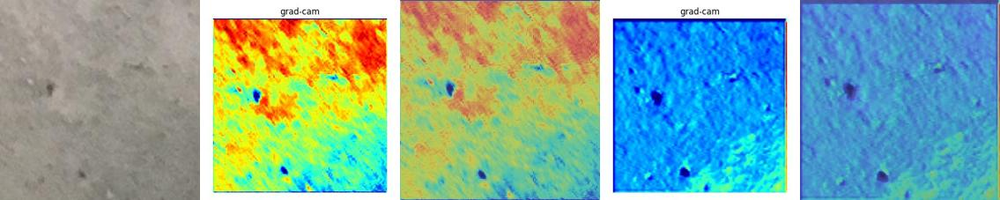
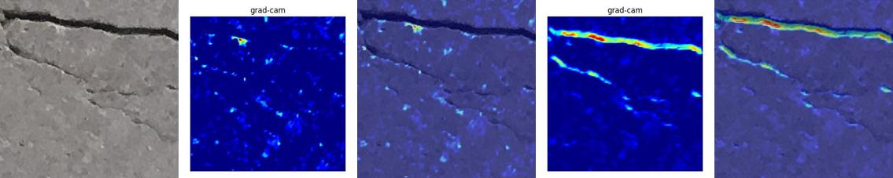
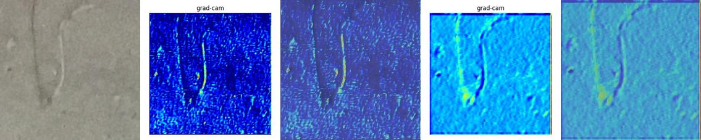
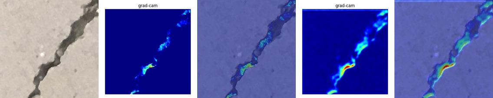
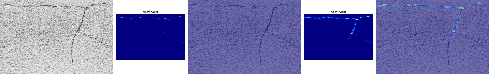
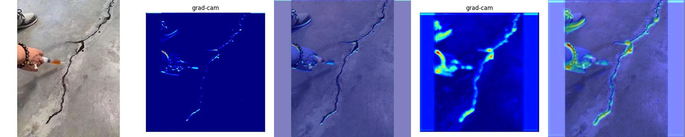

# EasyGradCAM Example: Concrete Crack Classification

This example demonstrates how to **train a CNN model for concrete crack detection** and then use **EasyGradCAM** to visualize the regions that contribute most to the classification decision.

---

## 📂 Folder Structure
```
example/
│── main.py          # Training script
│── test.py          # Grad-CAM visualization script
│── model.py         # Custom CNN model
│── dataset.py       # Custom dataset loader
│── data/            # Training & validation dataset
│   ├── train/
│   │   ├── healthy/
│   │   └── crack/
│   └── val/
│       ├── healthy/
│       └── crack/
│── test_img/        # Images for Grad-CAM testing
│── results/         # Saved Grad-CAM visualizations
│── runs/            # Training outputs (model checkpoints, loss/accuracy curves)
```

---

## 🚀 Step 1. Prepare Dataset
The dataset should be organized into `healthy/` and `crack/` subfolders under both `train/` and `val/`.  
You can download the dataset from [Kaggle: Concrete Crack Images](https://www.kaggle.com/datasets/arnavr10880/concrete-crack-images-for-classification).

Example structure:
```
data/train/healthy/xxx.jpg
data/train/crack/yyy.jpg
data/val/healthy/zzz.jpg
data/val/crack/kkk.jpg
```

---

## 🏋️ Step 2. Train Model
Run the training script:
```bash
python main.py
```

This will:
- Train the CNN defined in `model.py`
- Save training/validation **loss & accuracy curves** under `runs/`
- Save the trained model weights at:
  ```
  runs/concrete_crack_model.pth
  ```

---

## 🔍 Step 3. Run Grad-CAM Visualization
After training, run the Grad-CAM script:
```bash
python test.py
```

This will:
- Load the trained model
- Apply Grad-CAM on layers `conv1` and `conv2`
- Save heatmaps and overlay results into `results/`

Example output files:
```
results/test1-0-conv1.jpg        # Heatmap only
results/test1-0-conv1-mix.jpg    # Heatmap overlay
results/test1-0-conv2.jpg
results/test1-0-conv2-mix.jpg
```

---

## 📊 Training Outputs
After running `main.py`, you will find:
- **Loss Curve** → `runs/loss_curve.png`
- **Accuracy Curve** → `runs/accuracy_curve.png`

These curves help evaluate model convergence.

---

## 🌈 Example Visualization
test1-conv1_gradcam-conv1_mix-conv2_gradcam-conv2_mix  


test2-conv1_gradcam-conv1_mix-conv2_gradcam-conv2_mix  


test3-conv1_gradcam-conv1_mix-conv2_gradcam-conv2_mix  


test4-conv1_gradcam-conv1_mix-conv2_gradcam-conv2_mix  


test5-conv1_gradcam-conv1_mix-conv2_gradcam-conv2_mix  


test6-conv1_gradcam-conv1_mix-conv2_gradcam-conv2_mix  


---

## ⚠️ Notes
- The dataset must be placed correctly under `data/train` and `data/val`.
- Training parameters (batch size, learning rate, epochs) can be modified in `main.py`.
- Grad-CAM target layers (`conv1`, `conv2`) can be adjusted in `test.py` depending on the model structure.

---

## 🐞 Bugs / Requests
Please report issues on the [GitHub issue tracker](https://github.com/breeze0305/easy_gradcam/issues).
