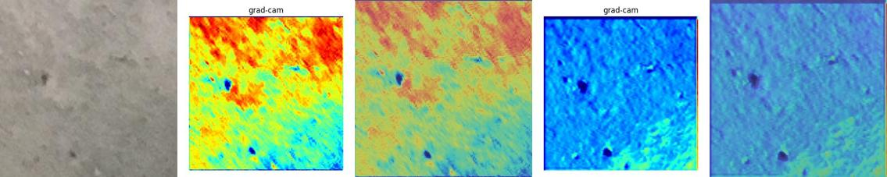
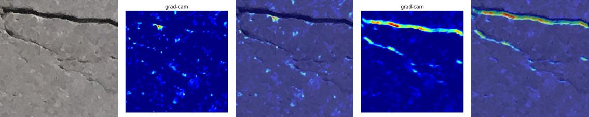

# EasyGradCAM 範例：混凝土裂縫分類

本範例展示如何 **訓練一個 CNN 模型進行混凝土裂縫檢測**，並使用 **EasyGradCAM** 來視覺化模型在分類判斷中最重要的區域。

---

## 📂 資料夾結構
```
example/
│── main.py          # 訓練腳本
│── test.py          # Grad-CAM 視覺化腳本
│── model.py         # 自訂 CNN 模型
│── dataset.py       # 自訂資料載入器
│── data/            # 訓練與驗證資料集
│   ├── train/
│   │   ├── healthy/
│   │   └── crack/
│   └── val/
│       ├── healthy/
│       └── crack/
│── test_img/        # 測試用圖片
│── results/         # 儲存 Grad-CAM 結果
│── runs/            # 訓練輸出（模型檔、曲線圖）
```

---

## 🚀 步驟 1. 準備資料集
資料集需依照 `healthy/` 與 `crack/` 子資料夾分類，並分為 `train/` 與 `val/`。  
可下載自 [Kaggle: Concrete Crack Images](https://www.kaggle.com/datasets/arnavr10880/concrete-crack-images-for-classification)。

範例結構：
```
data/train/healthy/xxx.jpg
data/train/crack/yyy.jpg
data/val/healthy/zzz.jpg
data/val/crack/kkk.jpg
```

---

## 🏋️ 步驟 2. 訓練模型
執行訓練腳本：
```bash
python main.py
```

這會：
- 使用 `model.py` 定義的 CNN 進行訓練  
- 在 `runs/` 下儲存訓練/驗證 **loss 與 accuracy 曲線**  
- 儲存訓練後的模型權重：
  ```
  runs/concrete_crack_model.pth
  ```

---

## 🔍 步驟 3. 執行 Grad-CAM 視覺化
訓練完成後，執行：
```bash
python test.py
```

這會：
- 載入訓練完成的模型  
- 對 `conv1` 與 `conv2` 層應用 Grad-CAM  
- 在 `results/` 下儲存熱力圖與疊合結果  

範例輸出檔案：
```
results/test1-0-conv1.jpg        # 純熱力圖
results/test1-0-conv1-mix.jpg    # 疊合圖
results/test1-0-conv2.jpg
results/test1-0-conv2-mix.jpg
```

---

## 📊 訓練輸出
執行 `main.py` 後會得到：
- **Loss 曲線** → `runs/loss_curve.png`
- **Accuracy 曲線** → `runs/accuracy_curve.png`

這些圖可幫助判斷模型收斂情況。

---

## 🌈 視覺化範例
test1-conv1_gradcam-conv1_mix-conv2_gradcam-conv2_mix  


test2-conv1_gradcam-conv1_mix-conv2_gradcam-conv2_mix  


test3-conv1_gradcam-conv1_mix-conv2_gradcam-conv2_mix  


test4-conv1_gradcam-conv1_mix-conv2_gradcam-conv2_mix  


test5-conv1_gradcam-conv1_mix-conv2_gradcam-conv2_mix  


test6-conv1_gradcam-conv1_mix-conv2_gradcam-conv2_mix  


---

## ⚠️ 注意事項
- 請確保資料集正確放置於 `data/train` 與 `data/val`。  
- 可於 `main.py` 中修改訓練參數（batch size、learning rate、epochs）。  
- Grad-CAM 目標層（`conv1`、`conv2`）可在 `test.py` 中調整。  

---

## 🐞 問題/需求
請於 [GitHub issue tracker](https://github.com/breeze0305/easy_gradcam/issues) 回報問題與需求。
